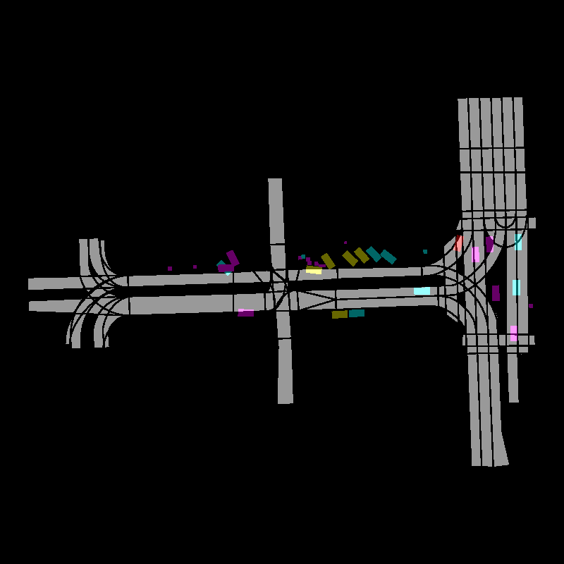

# Autoregressive Generative Model for Trajectory Prediction
This repository contains a script to train a model for predicting trajectories in traffic. The dataset used to train, validate and test is the Argoverse2 motion forecasting dataset. 

## Download the dataset
Clone the repository:
```bash
git clone https://github.com/lucegi/autoregressive-trajectory-prediction.git
cd autoregressive-trajectory-prediction
```
Install ```s5cmd``` binary locally in ```~/.local/bin``` and download the dataset:
```bash
bash download_dataset.sh
```

## Rasterize one scenario
The dataset is converted in a multi-channel image, where the map information is encoded in one channel, while the other three channels contain information about traffic participants.
To generate a multi-channel tensor of a scenario and plot it, run:
```bash
python3 visualize_agents.py
```
This will create the compressed tensor ```scene.pt.gz``` and an image for visualization purposes ```ìmage.png```:

