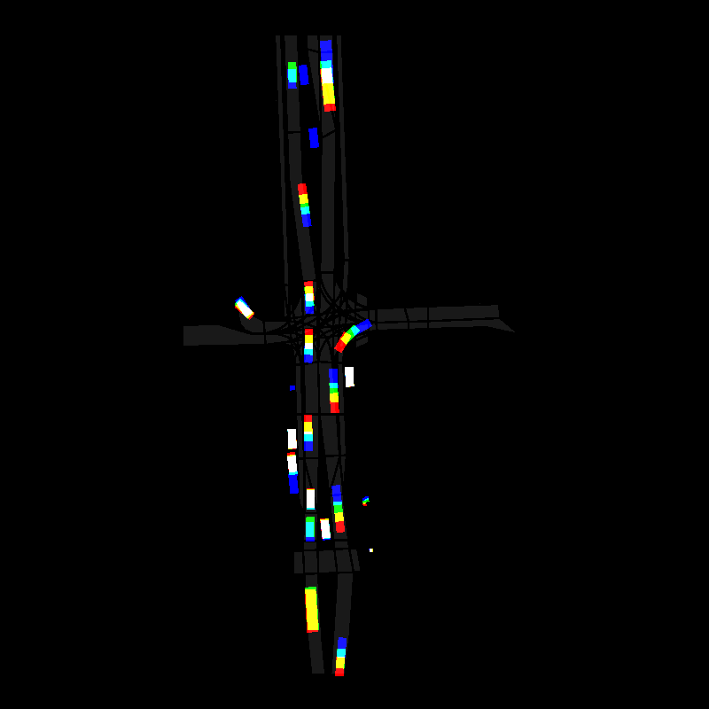

# Autoregressive Generative Model for Trajectory Prediction
This repository contains a script to train a model for predicting trajectories in traffic. The dataset used to train, validate and test is the Argoverse2 motion forecasting dataset. 

## Download the dataset
Clone the repository:
```bash
git clone https://github.com/lucegi/autoregressive-trajectory-prediction.git
cd autoregressive-trajectory-prediction
```
Install ```s5cmd``` binary locally in ```~/.local/bin``` and download the dataset:
```bash
bash download_dataset.sh
```
The dataset will have the following structure:
```bash
/dataset/
├── train/
│   ├── <scenario_id_1>/
│   │   ├── scenario_<scenario_id_1>.parquet
│   │   ├── log_map_archive_<scenario_id_1>.json
│   ├── <scenario_id_2>/
│   │   └── ...
├── validation/
│   ├── <scenario_id_3>/
│   │   └── ...
├── test/
│   ├── <scenario_id_4>/
│   │   └── ...
``` 

## Rasterize one scenario
The dataset is converted in images, where the three channels encode three timesteps of the traffic participants, the map is encoded as background in these three channel as well, but with a very low value (dark gray).
To generate an example of a scenario and plot it, run:
```bash
python3 raster_scenario.py
```
This will create the folder ```\image_generation_test```  that contains a sequence of frames and a json file with the trajectories in the scenario. A frame looks like this:


## Convert the Dataset
To convert the full dataset, run:
```bash
python3 dataset_conversion.py
```
This will create a dataset structure of the following way:
```bash
/converted_dataset/
├── train/
│   ├── <scenario_id_1>/
│   │   ├── image_0.png
│   │   ├── image_10.png
│   │   ├── image_20.png
│   │   ├── ...
│   │   └── trajectories.json
│   ├── <scenario_id_2>/
│   │   └── ...
├── validation/
│   ├── <scenario_id_3>/
│   │   └── ...
├── test/
│   ├── <scenario_id_4>/
│   │   └── ...
``` 
