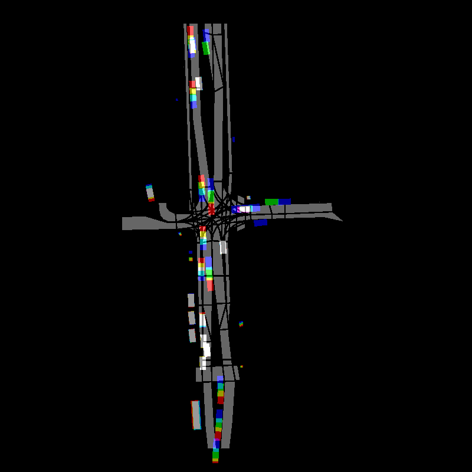

# Autoregressive Generative Model for Trajectory Prediction
This repository contains a script to train a model for predicting trajectories in traffic. The dataset used to train, validate and test is the Argoverse2 motion forecasting dataset. 

## Download the dataset
Clone the repository:
```bash
git clone https://github.com/lucegi/autoregressive-trajectory-prediction.git
cd autoregressive-trajectory-prediction
```
Install ```s5cmd``` binary locally in ```~/.local/bin``` and download the dataset:
```bash
bash download_dataset.sh
```
The dataset will have the following structure:
```bash
/dataset/
├── train/
│   ├── <scenario_id_1>/
│   │   ├── scenario_<scenario_id_1>.parquet
│   │   ├── log_map_archive_<scenario_id_1>.json
│   ├── <scenario_id_2>/
│   │   └── ...
├── validation/
│   ├── <scenario_id_3>/
│   │   └── ...
├── test/
│   ├── <scenario_id_4>/
│   │   └── ...
``` 

## Rasterize one scenario
The dataset is converted in a 4-channel image, where the map information is encoded in one channel, while the other three channels encode three timesteps of the traffic participants.
To generate a multi-channel tensor of a scenario and plot it, run:
```bash
python3 raster_scenario.py
```
This will create the compressed tensor ```scene.pt.gz``` and an image for visualization purposes ```ìmage.png```:


## Convert the Dataset
To convert the full dataset, run:
```bash
python3 dataset_conversion.py
```
This will create a dataset structure of the following way:
```bash
/converted_dataset/
├── train/
│   ├── <scenario_id_1>/
│   │   ├── scene_0.pt.gz
│   │   ├── image_0.png
│   │   ├── scene_10.pt.gz
│   │   ├── image_10.png
│   │   ├── ...
│   │   └── trajectories.json
│   ├── <scenario_id_2>/
│   │   └── ...
├── validation/
│   ├── <scenario_id_3>/
│   │   └── ...
├── test/
│   ├── <scenario_id_4>/
│   │   └── ...
``` 
